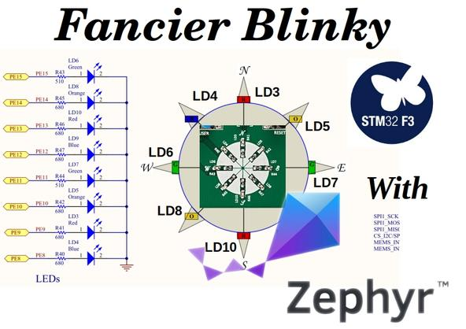

# Zephyr OS : Fancier-Blinky Project for STM32F3 Discovery board

This is a derived project from the original [`basic-blinky`](https://github.com/boseji/zephyr-basic-blinky-stm32f3_disco) for [**Zephyr OS**](https://www.zephyrproject.org/).
It helps to understand the various constituents of a typical
**Application Development** workflow for **Zephyr**.

In this project we are trying to also fix the **flashing** issue for **STM32F3 Discovery** Board with **PCB Revision C** and above.

We are using the [**STM32F3 Discovery**](https://www.st.com/en/evaluation-tools/stm32f3discovery.html)
board as a target for this project.

The goal of this project is:

1. Initialize all the **8 LEDs** on **STM32F3 Discovery** board
2. Display a *rotating pattern* using the LEDs
3. Be able to flash the code using `west` instead of the large `openocd` commands.

More on how to create this project:

<https://boseji.com/posts/zephyr-part-3-app-dev>

## Further Reading

There is a complete set of tutorials to help you get started on **Zephyr OS** :

- Installing the **Zephyr SDK**  
  <https://boseji.com/posts/zephyr-part-1-start/>
- Your first project to `blinky` example on **Zephyr OS** 
  <https://boseji.com/posts/zephyr-part-2-blinky-example-stm32f3discovery/>
- Application Development on **Zephyr OS** - creating the `fancier-blinky`  
  <https://boseji.com/posts/zephyr-part-3-app-dev>

## Add-on Project Scripts

Added here are two scripts for **Zephyr SDK**:

1. [`init-project`](https://github.com/boseji/zephyr-fancier-blinky-stm32f3_disco/blob/master/init-project) = This script can be used to generate the project files 
    needed for **Eclipse CDT** and generate the `ninja` aided build system.
    This is designed so that we can use `west` to build the project for **Zephyr OS**
    as well as do the same from **Eclipse CDT** IDE.

2. [`build-flash`](https://github.com/boseji/zephyr-fancier-blinky-stm32f3_disco/blob/master/build-flash) = This can be use after the `init-project` to automatically build and then 
   flash the code into the microcontroller.

## License

Copyright (c) 2020 Abhijit Bose <https://boseji.com>

SPDX-License-Identifier: Apache-2.0

All the files in this repository conform to
[Apache License, Version 2.0](http://www.apache.org/licenses/LICENSE-2.0)
unless otherwise specified.
